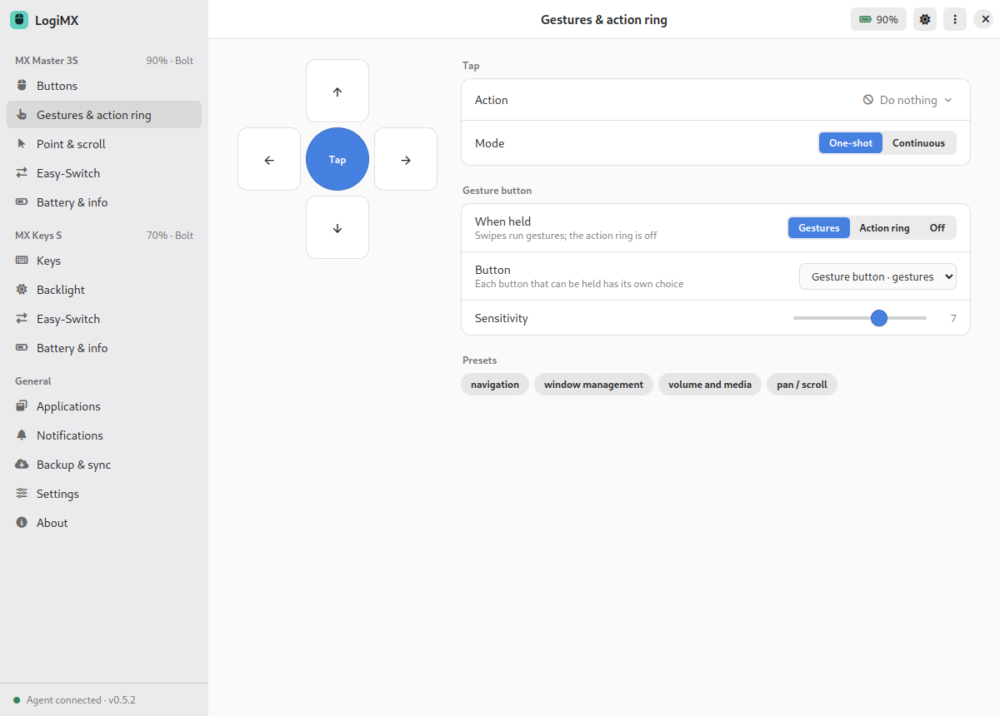
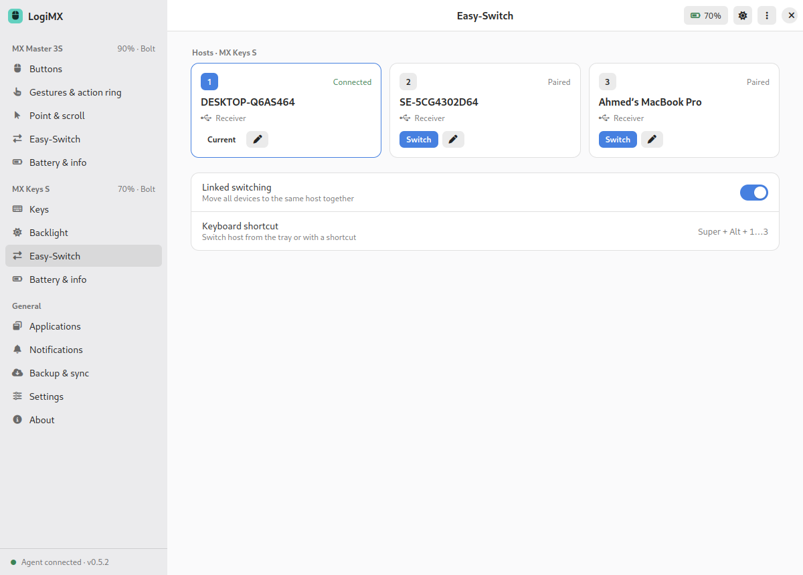
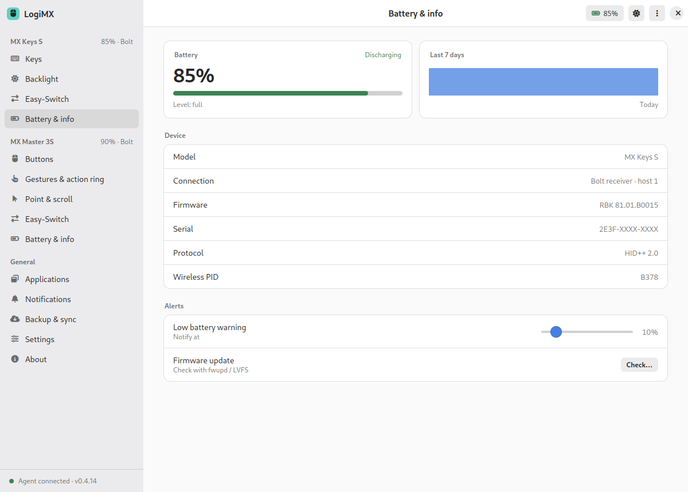
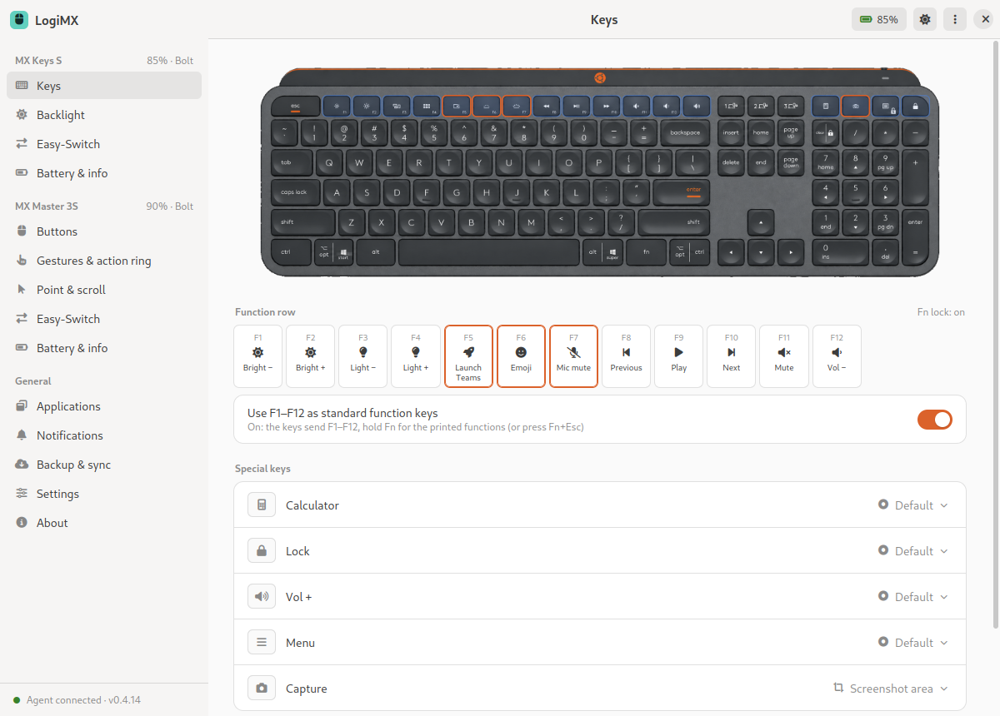
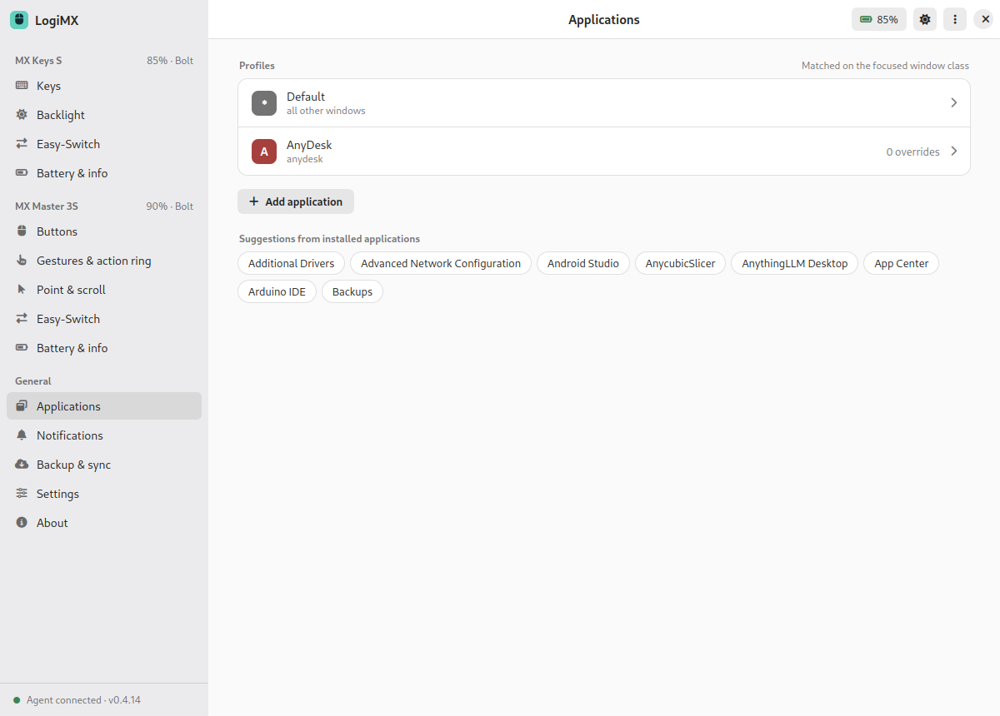

# LogiMX

[](https://github.com/aabdelghani/logimx/actions/workflows/release.yml)
[](https://github.com/aabdelghani/logimx/releases/latest)
[](LICENSE)
[](#requirements)
[](agent)
[](ui)
[](#features)

Third-party configuration app for the MX Master 3S and MX Keys S on Linux. It brings full
device configuration to GNOME, KDE and other desktops: button and key assignments, gestures,
thumb wheel actions, SmartShift, DPI, smart backlighting, Easy-Switch and per-application
profiles.

LogiMX is an independent project. It is not affiliated with, endorsed by, or supported by
the manufacturer of these devices. The device pictures in the app are the author's own and are
part of this repository under its license.


## How it is built

A native agent owns the devices in the background; the desktop UI talks to it over a local socket.


```
agent/          C++20 agent. HID++ 1.0/2.0 over hidraw, uinput for actions, X11 focus tracking,
                JSON RPC over a UNIX socket. No runtime dependencies beyond libc, libstdc++, libX11.
ui/             Electron UI, plain HTML/CSS/JS, talks to the agent over the socket.
logimx/    Python implementation of the same agent (same RPC and config schema). It was
                written first to validate the protocol against real hardware and is kept as a
                reference and for scripting.
udev/           hidraw and uinput access rule.
systemd/        user service unit for the agent.
```

The agent talks HID++ directly to the receiver or to a Bluetooth device, diverts the controls you
customise so the device sends HID++ events instead of the stock key, and synthesises the desktop
action through a virtual input device. That works the same under X11 and Wayland because it sits
below the compositor.

## Features

Mouse (MX Master 3S, MX Master 4)

- Assign any action to the middle, back, forward, gesture and mode shift buttons, with
  numbered callouts on a photo of the device
- Gestures: tap plus four swipe directions on a gesture pad, one-shot or continuous,
  adjustable sensitivity, any movement-capable button can be the gesture button
- Thumb wheel: horizontal or vertical scroll, zoom, volume, tabs, workspaces, brightness,
  direction and speed
- DPI 200 to 8000, desktop pointer speed, SmartShift on/off and sensitivity, a SmartShift
  toggle action, smooth scrolling, natural scroll direction
- Battery with 7-day history, firmware, serial, Easy-Switch host cards with one-click switching
- MX Master 4: the haptic panel as a button of its own (it opens the action ring out of the
  box), haptic feedback on or off with its strength, a tick as the ring moves and a thud when an
  action runs, a tick on gestures, sixteen patterns to try, how hard the panel has to be
  pressed, and the ratchet force of the wheel
- Action ring: eight actions of your choice around the pointer. It shares the gesture button with
  gestures ("Gestures & action ring" page: Gestures, Action ring or Off). Hold the button, nudge the mouse toward
  an action and let go to run it, or tap and click; or keep the pointer visible and free and
  simply point at the action. Several profiles of eight actions can be kept and switched. It
  takes the desktop's light or dark, accent colour and font, so it looks at home on Ubuntu,
  Fedora and the rest

Keyboard (MX Keys S; MX Keys, MX Keys for Mac, MX Keys for Business, MX Keys Mini and
Mini for Mac / for Business have their own photo, layout and defaults but no hardware test yet)

- Function row and special keys laid out from what the keyboard itself reports, with
  clickable keys on a photo of that model
- Built-in emoji picker: the Emoji key opens a searchable picker at the pointer
  (categories, recents, keyboard navigation), Enter pastes into the focused app
- Smart backlight: on/off, automatic or manual level, hands-away, hands-present and
  on-power timers
- Battery, firmware, Easy-Switch

Everything

- Adwaita-style window with four themes: Light, Dark, Ubuntu, Ubuntu dark
- Action picker with categories, search, a keystroke recorder, shell commands, typed text,
  open URL or folder, launch any installed application
- Per-application profiles with an override view (overridden vs inherited per control),
  suggestions from installed applications
- On-screen overlays when a key changes device state: microphone mute, SmartShift mode,
  backlight level, Easy-Switch host, DPI; position, duration and per-event switches
- Tray indicator with battery levels, Easy-Switch, pause diversion; desktop notifications
  for low battery (threshold configurable) and connect/disconnect
- Global shortcuts: Super+Alt+1..3 switch host, Super+Alt+O toggles overlays,
  Super+Alt+P pauses diversion
- Bolt pairing wizard with passkey confirmation, first-run wizard (permissions with pkexec
  udev install, devices, GNOME / macOS-like / Windows-like presets)
- Backup & sync: automatic daily backups, manual backups, restore, export/import, reset,
  read settings back from the device
- Settings: start at login (systemd user service), tray, close-to-tray, start hidden,
  appearance, update check; About with diagnostics log, export and copy
- Hot plug through inotify; settings re-applied when a device reconnects

## Screenshots

| Action ring | Action ring settings |
|---|---|
|  |  |

| Gestures | Point and scroll |
|---|---|
|  |  |

| Keyboard | Backlight |
|---|---|
|  |  |

| Action picker | Easy-Switch |
|---|---|
|  |  |

| Battery & info | Notifications and overlays |
|---|---|
|  |  |

| Emoji picker | Tray status panel |
|---|---|
|  |  |

| First run | Dark theme |
|---|---|
|  |  |

| Ubuntu theme | Applications |
|---|---|
|  |  |

| Report a problem | |
|---|---|
|  | |

## Install

Packages are attached to each [release](https://github.com/aabdelghani/logimx/releases). They are built
on GitHub's runners by the [release workflow](https://github.com/aabdelghani/logimx/actions/workflows/release.yml)
every time a version tag is pushed, so each asset can be traced back to a public build log.

**Debian / Ubuntu (.deb)**: agent, CLI, udev rule, systemd user unit, desktop entry and the app.

```
sudo apt install ./logimx_0.6.6_amd64.deb
systemctl --user enable --now logimx      # agent for the current session (automatic after the next login)
logimx                                    # or launch LogiMX from the app grid
```

**AppImage**: one file, no installation. The app starts the bundled agent itself and the first-run
wizard installs the udev rule with pkexec.

```
chmod +x LogiMX-0.6.6-x86_64.AppImage
./LogiMX-0.6.6-x86_64.AppImage
```

Build the packages yourself with `packaging/deb/build.sh` and `cd ui && npm run dist:appimage`.

## Requirements

- Linux with the kernel's HID++ receiver drivers (built into any mainstream distro)
- g++ 11 or newer, cmake, ninja, libx11-dev
- node 18 or newer for the UI
- Read and write access to `/dev/hidraw*` for the receiver and to `/dev/uinput`
  (`udev/60-logimx.rules`, or the rule that ships with Solaar)

Stop other tools that divert the same buttons (Solaar, logid) while LogiMX runs, otherwise
two programs fight over the device. On GNOME the tray icon needs the AppIndicator extension
(`gnome-shell-extension-appindicator`), which Ubuntu ships enabled.

## Quick start (from source)

```
./run-agent.sh -v            # terminal 1: builds on first run, logs to stderr
./run-ui.sh                  # terminal 2: window and tray icon (--hidden starts in the tray)
./agent/build/logimxctl devices
```

Install for the current user (agent in `~/.local/bin`, systemd user service):

```
./install.sh
sudo cp udev/60-logimx.rules /etc/udev/rules.d/ && sudo udevadm control --reload && sudo udevadm trigger
```

## Pairing to the receiver

Use "Pair a device" in the app menu. If the device you are pairing is also known to Bluetooth on
the same machine, the pairing can fail a few seconds after the passcode is typed: BlueZ keeps
trying to reconnect to it and that traffic shares the 2.4 GHz band with the Bolt handshake. Pair
with the adapter switched off instead:

```
./pair-bolt.sh
```

It powers Bluetooth down, holds discovery open until the device appears, shows the passcode, and
restores Bluetooth on exit.

## Command line

```
logimxctl devices
logimxctl set b034 dpi 1600
logimxctl set b034 smartshift.threshold 20
logimxctl set b378 backlight.mode manual
logimxctl set b378 backlight.level 5
logimxctl assign b034 buttons 195 gesture_windows
logimxctl assign b034 thumbwheel - volume_wheel
logimxctl assign b378 keys 264 emoji_picker
logimxctl host b378 2
logimxctl presets
```

Configuration lives in `~/.config/logimx/config.json`. Device ids are the product ids
(`b034` MX Master 3S, `b042` MX Master 4, `b378` MX Keys S), controls are HID++ control ids.

## Reporting a problem

About, Report a problem gathers what is needed to reproduce it (versions, desktop, the devices and
what they report, the last lines of the agent's log) and opens a new issue on GitHub in your browser
with that filled in. You see the whole text first. Serial numbers, host names and your user name
are removed, custom commands are reduced to their kind, and LogiMX itself sends nothing anywhere:
the issue is filed by you, from your own account.

## Status

Tested on Ubuntu 24.04 with GNOME on X11, MX Master 3S, MX Master 4 and MX Keys S on a Bolt receiver.
Bluetooth connections work the same way as the receiver (tested with the MX Keys S paired directly).
The other MX Keys models are set up from their published key layouts and have not been on this
bench; reports welcome. GNOME on Wayland
tracks the focused application through the Shell introspection interface when it is enabled.

Planned: more MX devices, pairing UI, KDE and Sway focus tracking, packaging.

## Related projects

- [Solaar](https://github.com/pwr-Solaar/Solaar): device manager for Unifying and Bolt receivers, broad HID++ feature coverage
- [logiops](https://github.com/PixlOne/logiops): daemon with gestures and SmartShift, configured through a text file
- [libratbag](https://github.com/libratbag/libratbag) and Piper: DPI and button configuration for gaming mice

LogiMX differs by pairing a native agent with a full desktop UI, per-application profiles
and a gesture editor, so the day-to-day experience matches what users get on Windows and macOS.

## Keywords

MX Master 3S Linux, MX Keys S Linux, MX Master gestures Linux, thumb wheel Linux, SmartShift Linux,
MX Keys backlight Linux, Bolt receiver Linux, Unifying receiver Linux, HID++ configuration,
GNOME, KDE, Wayland, X11, uinput, hidraw.

## License

MIT
