

  <picture>
    <source media="(prefers-color-scheme: dark)" srcset="docs/logo-dark.png">
    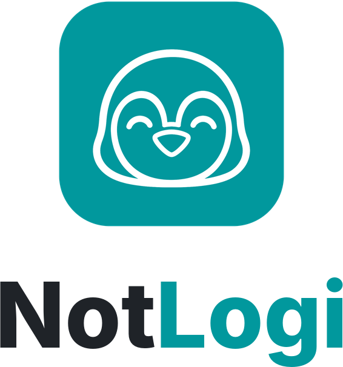
  </picture>

<b>Unofficial mouse &amp; keyboard tools for Linux</b> (formerly LogiMX)

# NotLogi

NotLogi sets up MX mice and keyboards on Linux, with Windows and macOS in beta. Choose what every
button and key does, open an **action ring** of your favourite actions around the pointer, and use
one mouse and keyboard across several computers with **Flow**. It works on GNOME, KDE and other
desktops, on X11 and Wayland.

NotLogi is an independent project. It is not affiliated with, endorsed by, or supported by the
manufacturer of these devices.

| Action ring | The ring on the desktop |
|---|---|
|  |  |

## Install

Download from the [latest release](https://github.com/aabdelghani/notlogi/releases/latest).

- **Ubuntu / Debian**: `sudo apt install ./logimx_0.12.1_amd64.deb`, then open NotLogi from the app grid.
- **Any Linux**: make the AppImage executable and run it.
- **Windows 10 and 11** (beta): run the setup. If SmartScreen asks, choose **More info**, then
  **Run anyway**.
- **macOS 12 or newer** (beta): open the .dmg and drag NotLogi to Applications (signed and
  notarized, so it opens like any app), then allow **Accessibility** and **Input Monitoring** when asked.

Quit Logi Options+, Solaar or logiops while NotLogi runs: they drive the same buttons.

## Supported devices

| Device | State |
|---|---|
| MX Master 4 | Tested |
| MX Master 3S | Tested |
| MX Keys S | Tested |
| MX Keys, MX Keys for Mac, MX Keys for Business | Working, reported by users |
| MX Anywhere 3S | Included, not yet tested |
| MX Keys Mini, Mini for Mac, Mini for Business | Included, not yet tested |

Through a Bolt or Unifying receiver, or over Bluetooth.

## Features

### Flow

One mouse and keyboard for several computers (Linux and macOS; Windows untested). Move the pointer
off the edge of the screen and it carries on on the next computer, with the keyboard and the
clipboard.

- Set up in three steps: install NotLogi on both, pair the mouse on another channel, same network
- Drag the computers' screens to where they sit
- Switch at the edge, or only while holding Ctrl

| Flow | Flow settings |
|---|---|
| 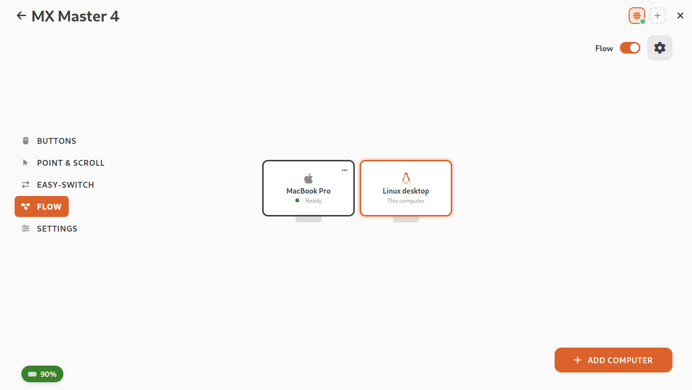 | 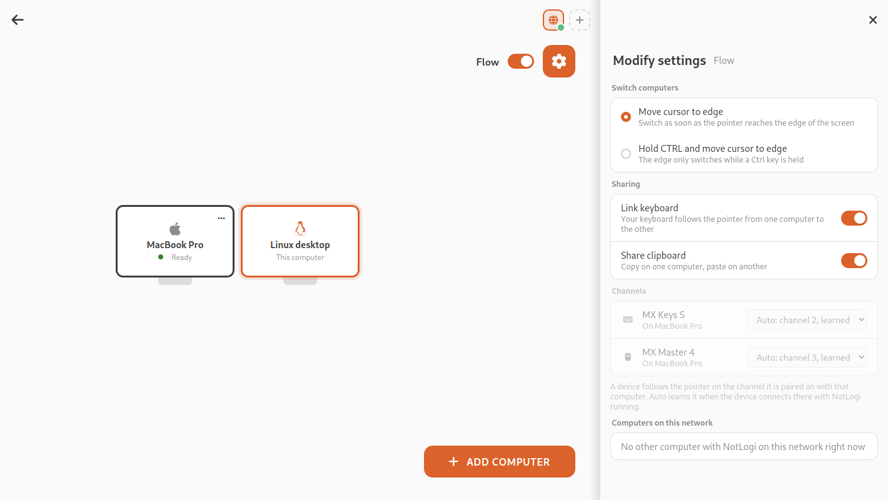 |

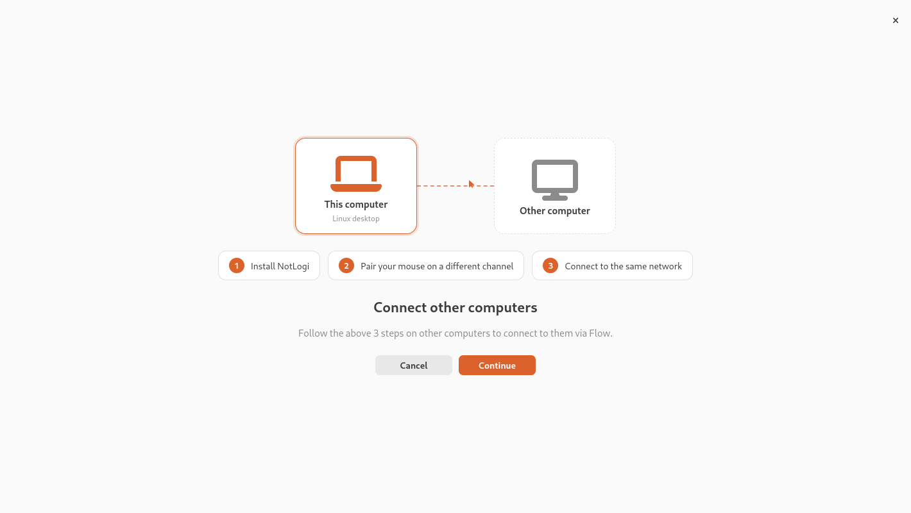

### Action ring

Hold a button, flick toward an action, let go. Up to eight actions around the pointer.

- Click a slot to pick its action, or drag one onto it
- **Folders**: put more actions behind one slot; they open on a second circle around the ring
- Several ring profiles, and a different ring per application
- Volume and brightness: hold and drag to set the level
- Small, medium or large

| A folder in the settings | The folder on the ring |
|---|---|
| 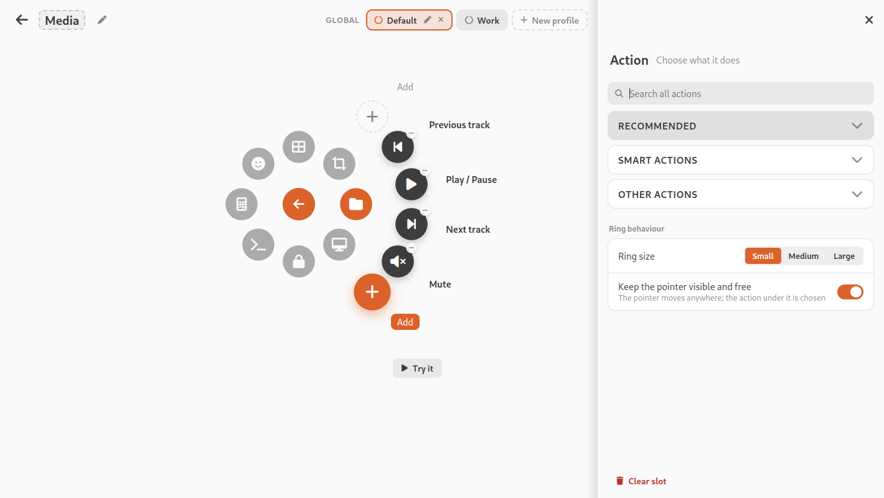 | 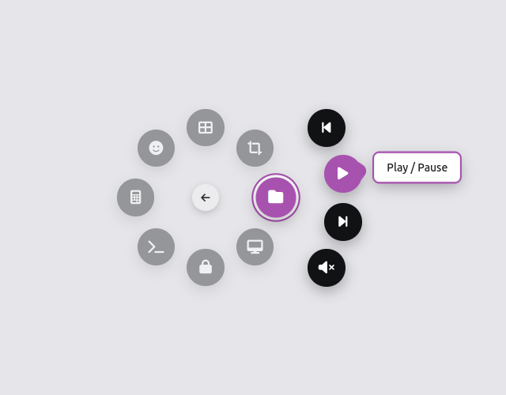 |

### MX Master 4

- Haptic feedback with its strength, felt as the action ring moves
- The haptic panel as a button of its own (it opens the action ring out of the box)
- How hard the panel has to be pressed, and the wheel's ratchet force
- Easy-Switch on a photo of its underside

| Buttons and the haptic panel | Easy-Switch |
|---|---|
| 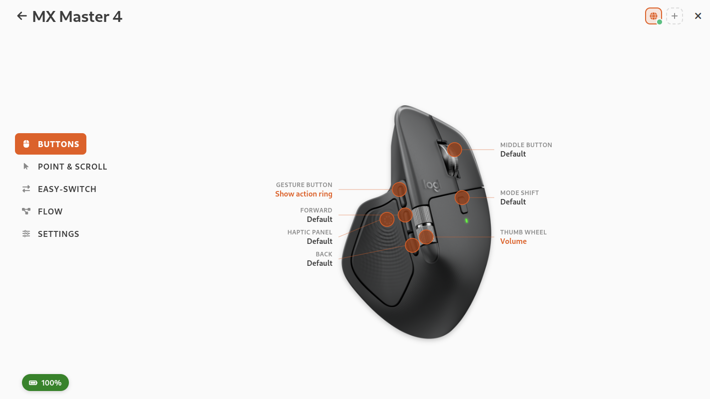 | 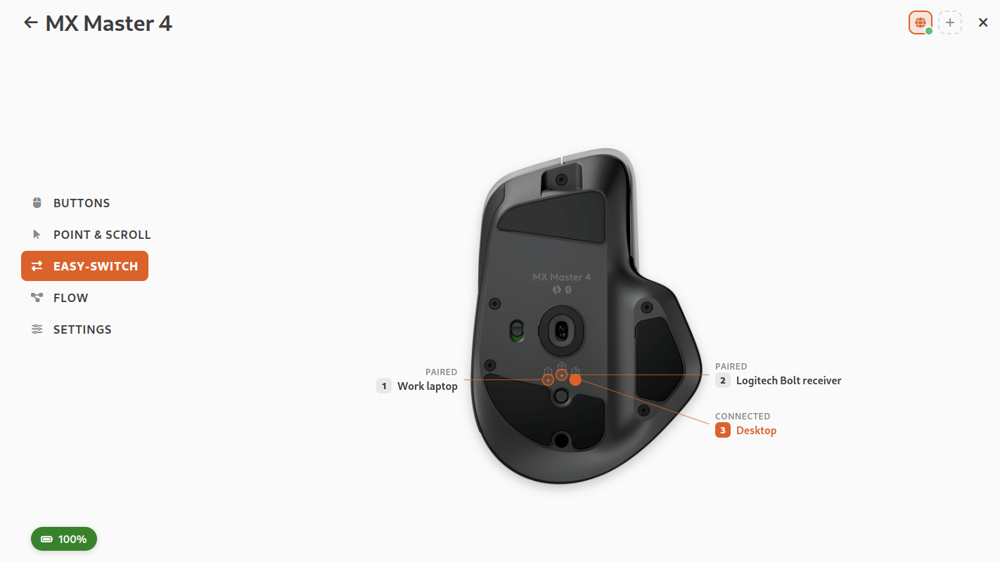 |

### Home

Your devices with their battery level.

### Mouse buttons

Click a button on the photo and choose what it does: suggestions, shortcuts, commands, apps, media,
the action ring or gestures.

### Application profiles

Give an application its own buttons and keys. The profile follows the window in front.

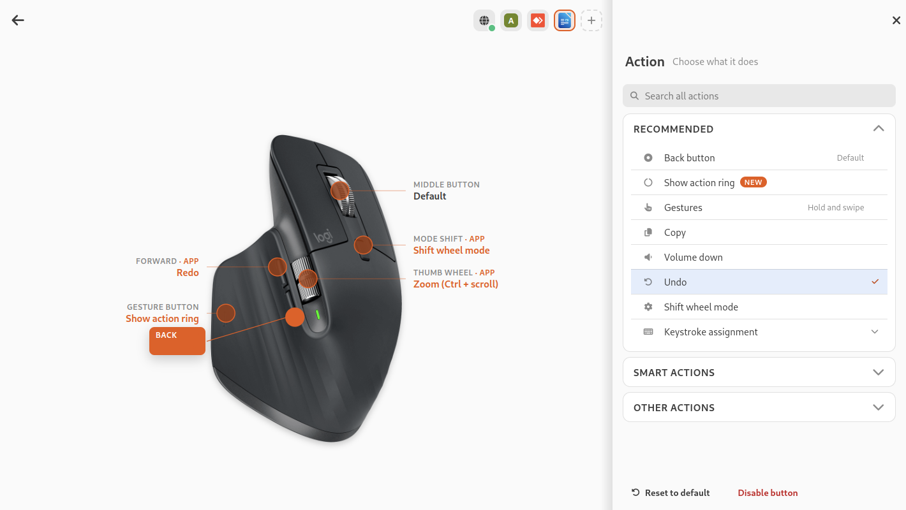

### Point and scroll

Pointer speed, SmartShift, smooth scrolling and scroll direction. The thumb wheel can scroll, zoom,
or change volume, tabs or workspaces.

### Gestures

Hold a button and swipe up, down, left or right to run an action.

### Keyboard keys

Click a key on the photo of your keyboard and choose what it does.

| Keyboard | Key actions |
|---|---|
|  |  |

### Backlight

On or off, automatic or a fixed level, and how long it stays on.

### Device settings

F keys as standard keys or media keys, lock keys on or off, and the battery over the last week.

### Emoji picker

The Emoji key opens a searchable picker at the pointer.

### Overlays, tray and notifications

On-screen notices when you mute the mic or switch computers, battery levels in the tray, and a
warning when the battery runs low.

| Notifications | Tray |
|---|---|
|  |  |

### Themes

Light, Dark, Ubuntu and Ubuntu dark.

| Dark | GNOME |
|---|---|
|  |  |

### Bluetooth

Put a mouse or keyboard in pairing mode and NotLogi offers to connect it.

| Pairing pop-up | Add device over Bluetooth |
|---|---|
| 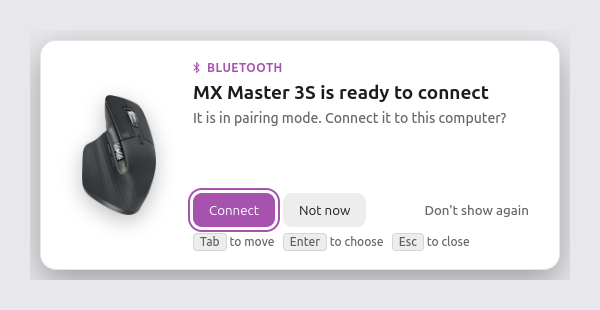 | 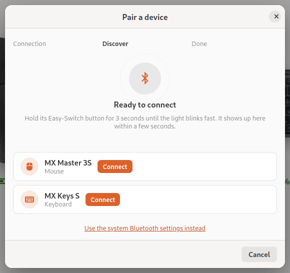 |

### More

- Pair with a Bolt receiver
- Back up, restore, export and import your settings
- Start at login, or hidden in the tray
- A first-run wizard that sets everything up

## Wishes and problems

**Make a wish** or **Report an issue** from the home screen. A report fills in what is needed and
leaves out personal details; it is filed from your own GitHub account.

| Make a wish | Report a problem |
|---|---|
|  |  |

## How it works

A small background agent talks to the devices; the app is its settings window.

Building from source, the command line and the technical details are in
[docs/DEVELOPMENT.md](docs/DEVELOPMENT.md).

## Related projects

- [Solaar](https://github.com/pwr-Solaar/Solaar): device manager for Unifying and Bolt receivers
- [logiops](https://github.com/PixlOne/logiops): daemon with gestures and SmartShift
- [libratbag](https://github.com/libratbag/libratbag) and Piper: DPI and buttons for gaming mice
