# LogiMX

[](https://github.com/aabdelghani/logimx/actions/workflows/release.yml)
[](https://github.com/aabdelghani/logimx/releases/latest)
[](LICENSE)
[](#requirements)
[](#supported-devices)
[](#action-ring)

LogiMX configures MX mice and keyboards on Linux, Windows (beta) and macOS (beta), with full support for the **MX Master 4** and an
**action ring**: eight actions of your choice around the pointer, opened by a button and chosen
with a flick of the mouse. It also covers button and key assignments, gestures, the thumb wheel,
SmartShift, DPI, the keyboard backlight and more. On Linux it runs on GNOME, KDE and other
desktops, on X11 and Wayland.

LogiMX is an independent project. It is not affiliated with, endorsed by, or supported by the
manufacturer of these devices. The device pictures in the app belong to this repository and are
covered by its license.

| Action ring | The ring on the desktop |
|---|---|
| 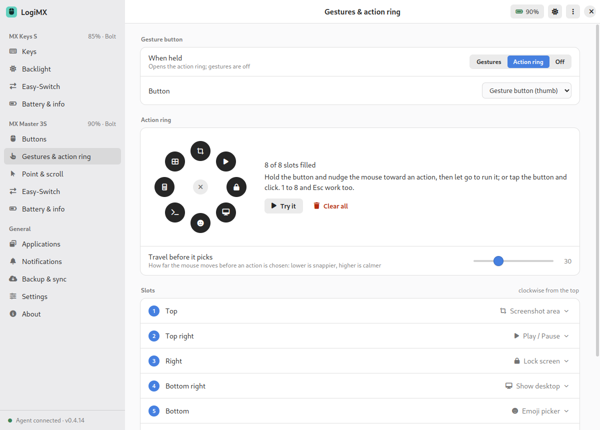 | 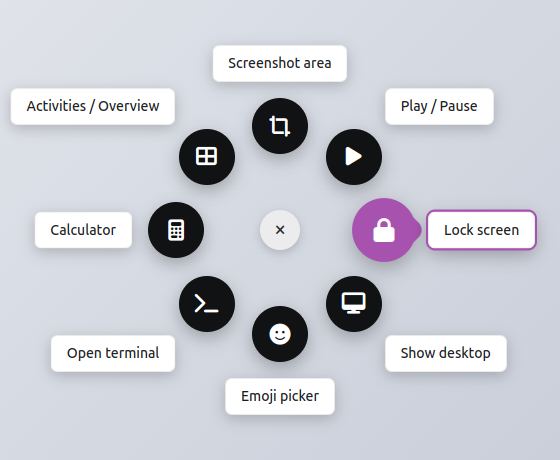 |

## Highlights

- **Action ring.** Hold a button, flick toward an action, let go. Eight slots, several profiles,
  drag and drop from the action list onto the ring, a free-pointer mode, and the desktop's own
  light or dark style, accent colour and font. On the MX Master 4 each step of the ring is felt
  as a haptic tick.
- **MX Master 4.** Haptic feedback with its strength, the haptic panel as a button of its own
  (it opens the action ring out of the box), how hard the panel must be pressed, and the ratchet
  force of the wheel.
- **Every button and key on a photo of the device**, with the actions for the one clicked in a
  panel beside it.

## Contents

- [Install](#install)
- [Supported devices](#supported-devices)
- [Features](#features)
- [How it works](#how-it-works)
- [Requirements](#requirements)
- [Build from source](#build-from-source)
- [Pairing to a Bolt receiver](#pairing-to-a-bolt-receiver)
- [Command line](#command-line)
- [Reporting a problem](#reporting-a-problem)
- [Status](#status)
- [Related projects](#related-projects)
- [License](#license)

## Install

Packages are attached to each [release](https://github.com/aabdelghani/logimx/releases). They are
built by CI from the tagged source.

**Debian / Ubuntu (.deb)**: installs the app, the agent, the udev rule and a systemd user service.

```
sudo apt install ./logimx_0.7.0_amd64.deb
systemctl --user enable --now logimx      # starts the agent now; it starts by itself after the next login
logimx                                    # or open LogiMX from the app grid
```

**AppImage**: a single file with nothing to install. It starts its own agent, and the first-run
wizard installs the udev rule through pkexec.

```
chmod +x LogiMX-0.7.0-x86_64.AppImage
./LogiMX-0.7.0-x86_64.AppImage
```

**Windows 10 and 11 (LogiMX-Setup-0.7.0.exe), beta**: a setup wizard. It shows the license, asks
whether to install for you alone or for everyone on the computer, lets you choose the folder, and
offers to start LogiMX at sign-in and to put a shortcut on the desktop. Nothing else is needed: no
driver, no runtime. The setup is not signed yet, so SmartScreen asks once: choose **More info**,
then **Run anyway**. Uninstall from **Settings > Apps**; your settings stay in `%APPDATA%\LogiMX`.

**macOS 11 or newer (LogiMX-0.7.0-arm64.dmg for Apple silicon, -x64.dmg for Intel), beta**: open the
disk image, agree to the license and drag LogiMX to Applications. The app is not notarized yet, so
the first time, right-click it and choose **Open** (on macOS 15, **System Settings > Privacy &
Security > Open Anyway**). LogiMX then asks for the **Accessibility** permission, which it needs to
press keys and buttons for you.

Quit Logi Options+ while LogiMX runs on Windows or macOS: both drive the same devices.

The Windows and macOS versions are in beta: they are built from the same code as the Linux
version, but have not been through the same testing on real devices yet. If something does not
work, the **Report a problem** button in the app opens a pre-filled issue.

## Supported devices

| Device | Product id | State |
|---|---|---|
| MX Master 3S | b034 | Tested |
| MX Master 4 | b042 | Tested |
| MX Keys S | b378 | Tested |
| MX Keys, MX Keys for Mac, MX Keys for Business | 408a, b35b, b361, b363 | Photo, layout and defaults included; reported working by users |
| MX Keys Mini, Mini for Mac, Mini for Business | b369, b36a, b36e | Photo, layout and defaults included; not yet tested |

Devices work through a Bolt or Unifying receiver and over Bluetooth.

## Features

### Action ring

Eight actions around the pointer. Hold the button, move toward an action and release to run it,
or tap the button and click. With "Keep the pointer visible and free" on, point at an action
instead of steering. The ring takes the desktop's light or dark style, accent colour and font.
Empty slots are left out.

On its page, click a slot to choose its action, or drag an action from the panel onto a slot.
Several ring profiles can be kept and switched from the panel.

- **Per-app rings**: pick an application in the profile bar and give it a ring of its own; the ring
  follows the application in front.
- **Size**: Small, Medium or Large.
- **Folders**: a slot that opens eight more actions in place; the middle goes back.
- **Volume and Brightness**: hold and drag to set the level, only the level bar stays on screen and
  the ring comes back on release; or scroll over the slot with the ring open. Brightness follows
  the screen under the pointer (laptop backlight, or external monitors over DDC/CI with ddcutil;
  the app offers a one-click setup when something is missing).
- **Next ring profile** and **Easy-Switch** to another computer, from the ring itself.

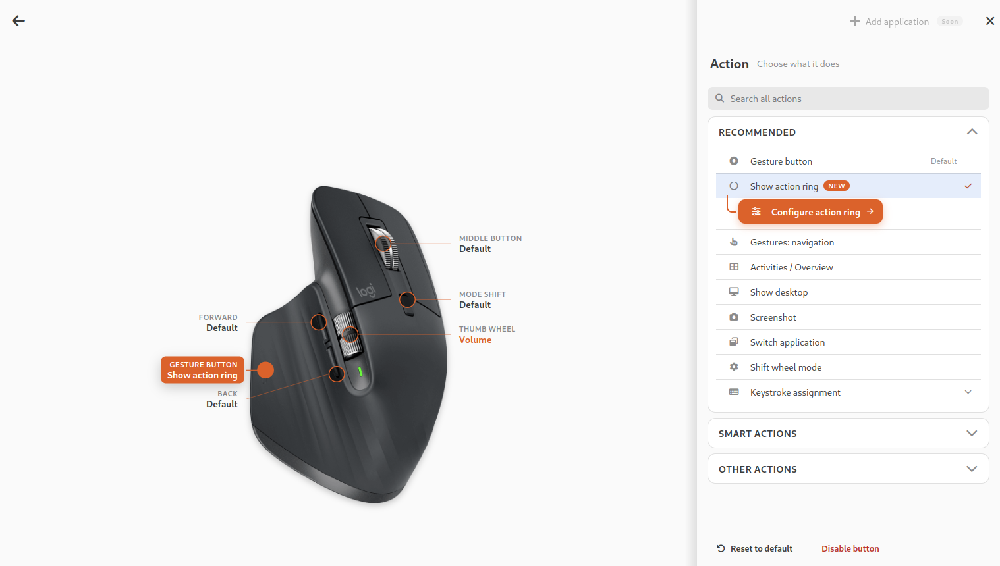

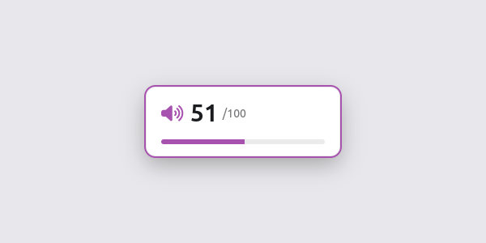

### MX Master 4

- Haptic feedback on or off, with its strength
- A tick as the action ring moves from one action to the next, and a thud when an action runs
- The haptic panel under the thumb as a button of its own; out of the box it opens the action ring
- How hard the haptic panel has to be pressed
- The ratchet force of the scroll wheel
- Sixteen haptic patterns to try

### Welcome screen

The connected devices with their battery level. A device that is not connected is shown greyed
out. When there are more devices than fit, arrows and the arrow keys page through them.

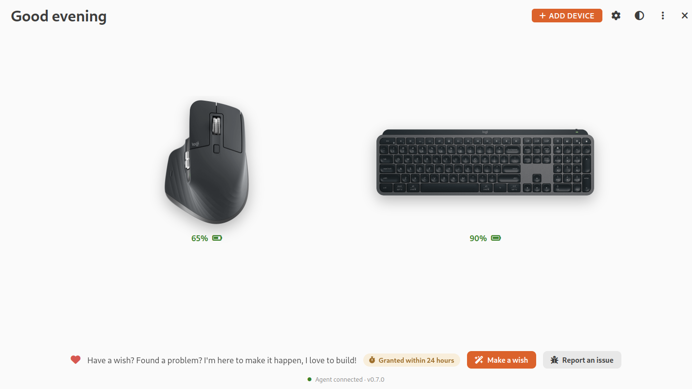

### Mouse buttons

Each button is marked on a photo of the mouse with its name and current action. Clicking a button,
or its name, opens its actions on the right:

- **Recommended**: the button's own function, suggestions for that button, the action ring and a
  keystroke recorder
- **Smart actions**: run a command, type text, open a URL, file or folder, or launch an application
- **Other actions**: navigation, editing, media and audio, device actions (DPI, SmartShift,
  Easy-Switch, gestures) and any single key

Choosing an action applies it at once.

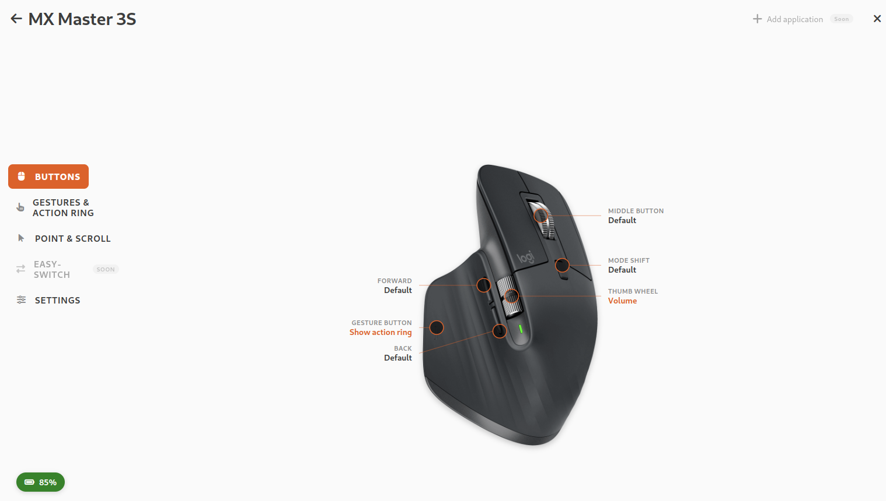

### Point and scroll

DPI from 200 to 8000, desktop pointer speed, SmartShift with its sensitivity, smooth scrolling and
natural scroll direction. The thumb wheel can scroll horizontally or vertically, zoom, or change
volume, tabs, workspaces or brightness.

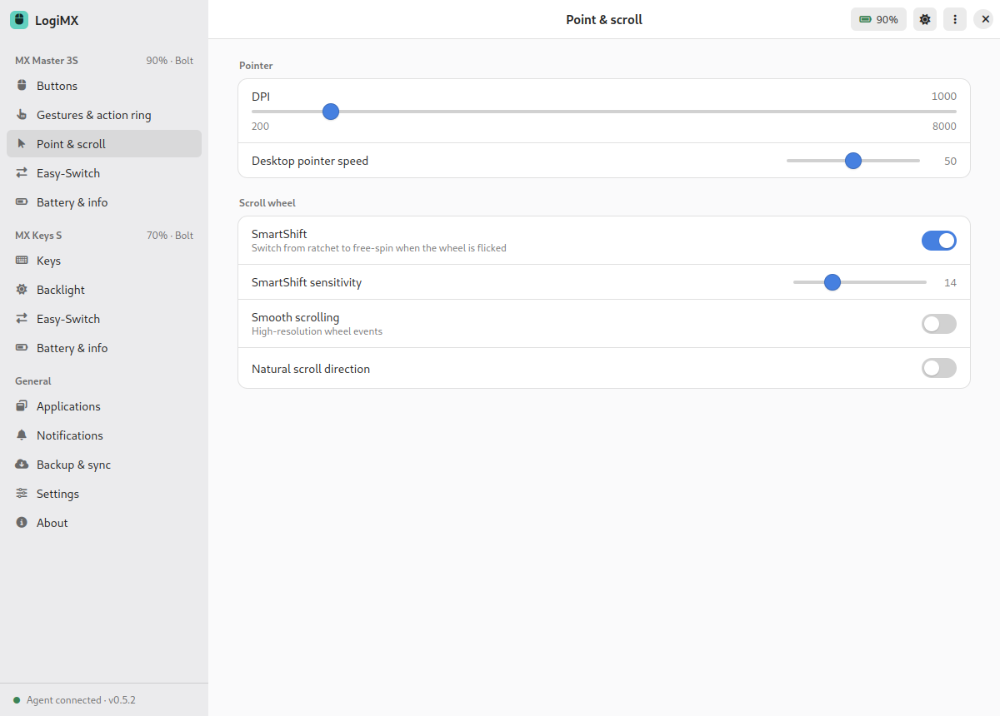

### Gestures

A tap and four swipes on any button that can be held, each running one action once or repeatedly
while the hand keeps moving. The button carries either gestures or the action ring.

### Keyboard keys

The keys the keyboard can reassign are marked on a photo of that model. Hovering shows what a key
does; clicking it opens the same actions panel as the mouse, including every single key grouped as
F keys, letters, numbers, symbols, number pad, modifiers and navigation.

| Keyboard | Key actions |
|---|---|
| 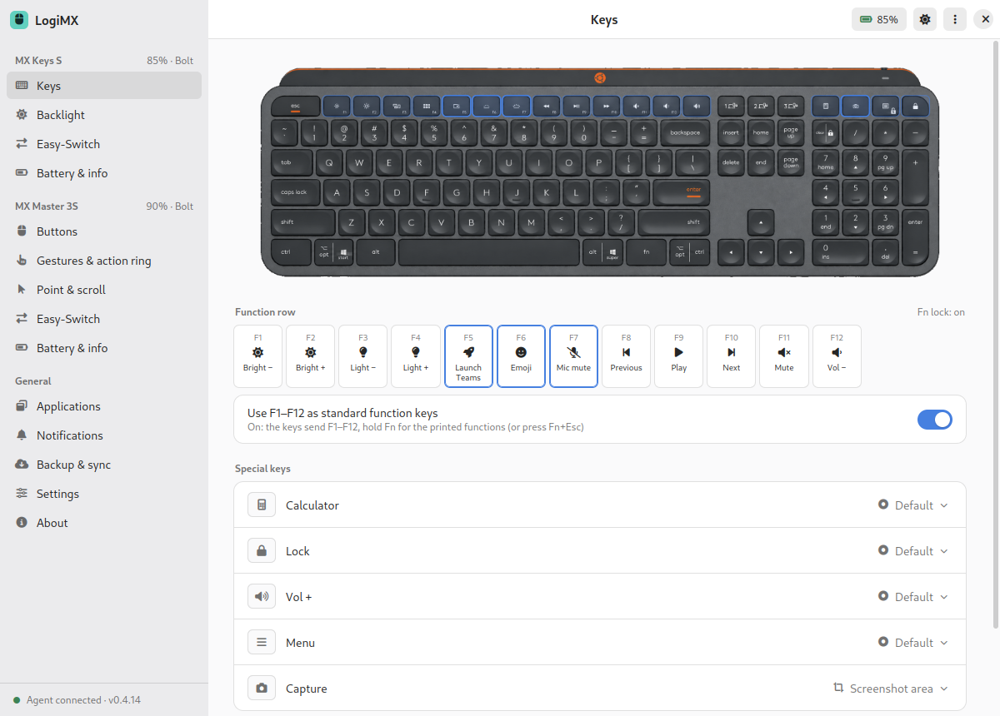 | 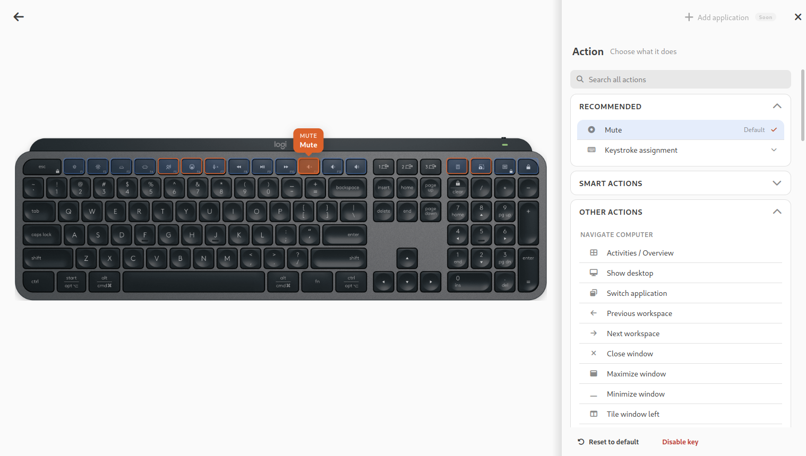 |

### Backlight

On or off, automatic brightness from the light sensor or a fixed level, how long it stays on after
the hands leave the keys, and a battery saving mode. A tag above the keyboard shows the current
setting and opens the panel.

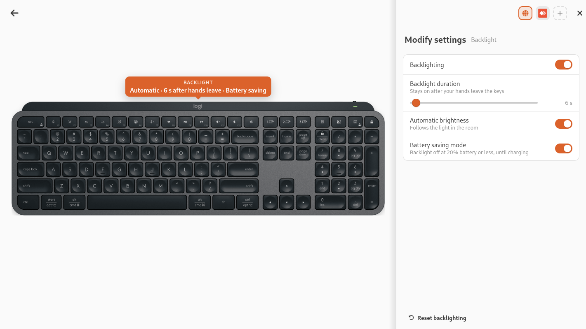

### Device settings

F1 to F12 as standard function keys or as the printed functions (Fn + Esc switches too), keeping
the keyboard layout fixed, switching off Caps Lock, Num Lock, Scroll Lock, Insert or the Windows
key, saving and restoring the device's settings, and the battery with its history over the last
seven days.

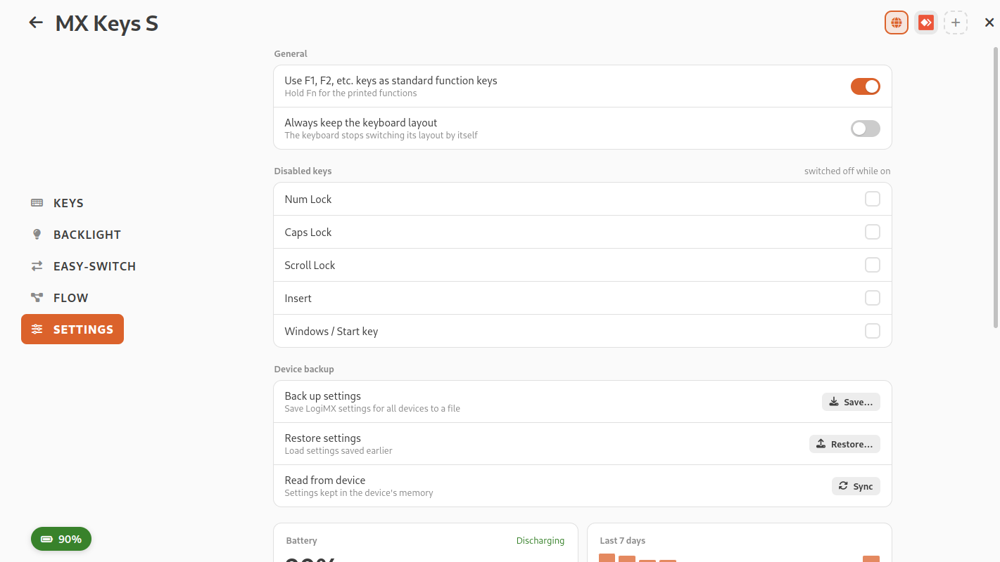

### Emoji picker

The Emoji key opens a searchable picker at the pointer, with categories, recent emoji and keyboard
navigation. Enter pastes into the focused application.

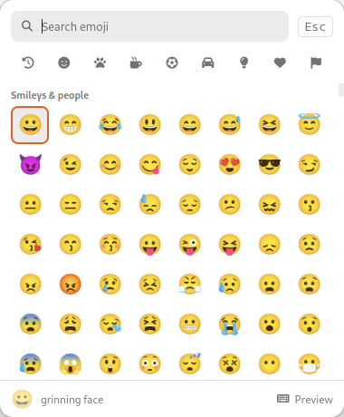

### Overlays, tray and notifications

- On-screen overlays when a key changes the device: microphone mute, SmartShift mode, backlight
  level, Easy-Switch host and DPI, with position, duration and a switch per event
- A tray indicator with battery levels, Easy-Switch and a pause switch
- Desktop notifications for low battery (threshold configurable) and for devices connecting and
  disconnecting
- Global shortcuts: Super+Alt+1 to 3 switch host, Super+Alt+O turns overlays on or off,
  Super+Alt+P pauses LogiMX

| Notifications | Tray |
|---|---|
| 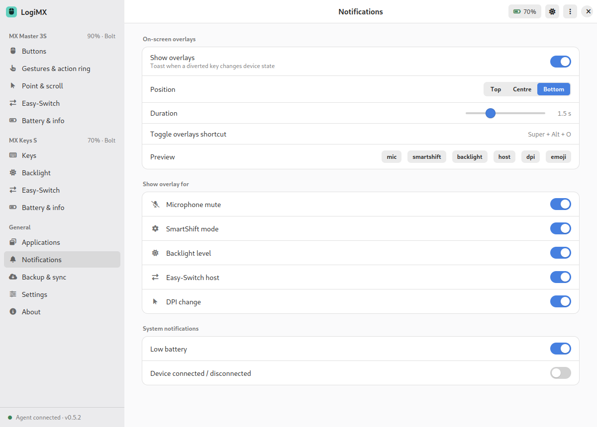 | 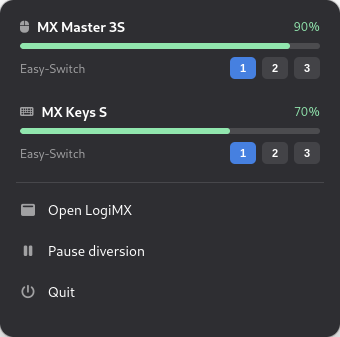 |

### Themes

Light, Dark, Ubuntu and Ubuntu dark.

| Dark | GNOME |
|---|---|
| 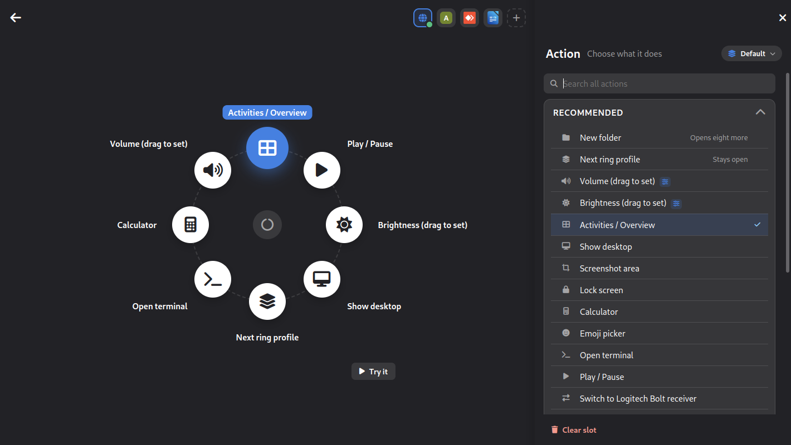 | 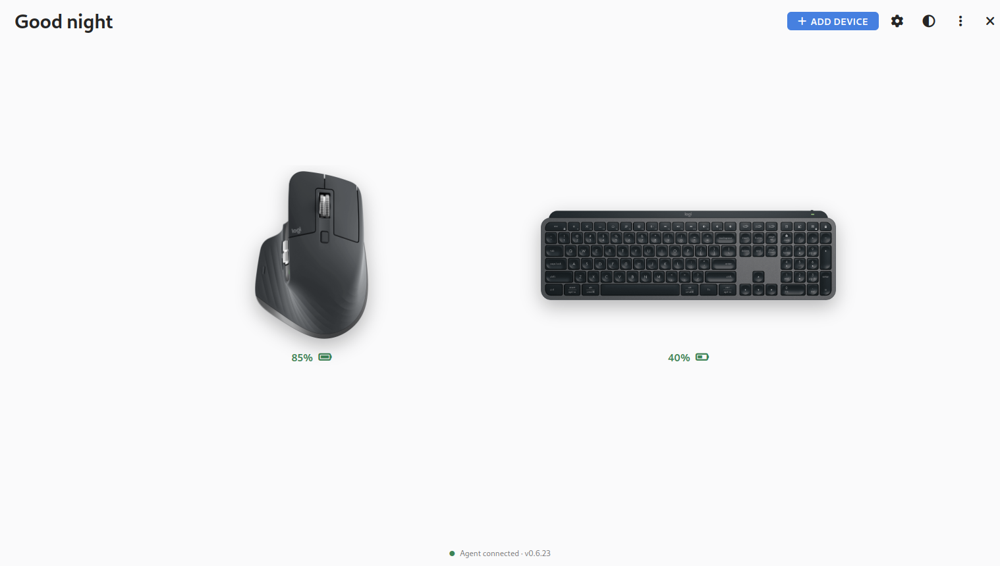 |

### More

- Per-application profiles, from the menu: a button or key can do something else while a given
  application is in front, and everything not changed follows the default profile
- Bolt pairing with passkey confirmation
- First-run wizard: permissions (udev rule installed through pkexec), devices, and GNOME, macOS-like
  or Windows-like presets
- Backups on request, restore, export and import, reset, and reading settings back from the device
- Start at login, close to the tray, start hidden, update check

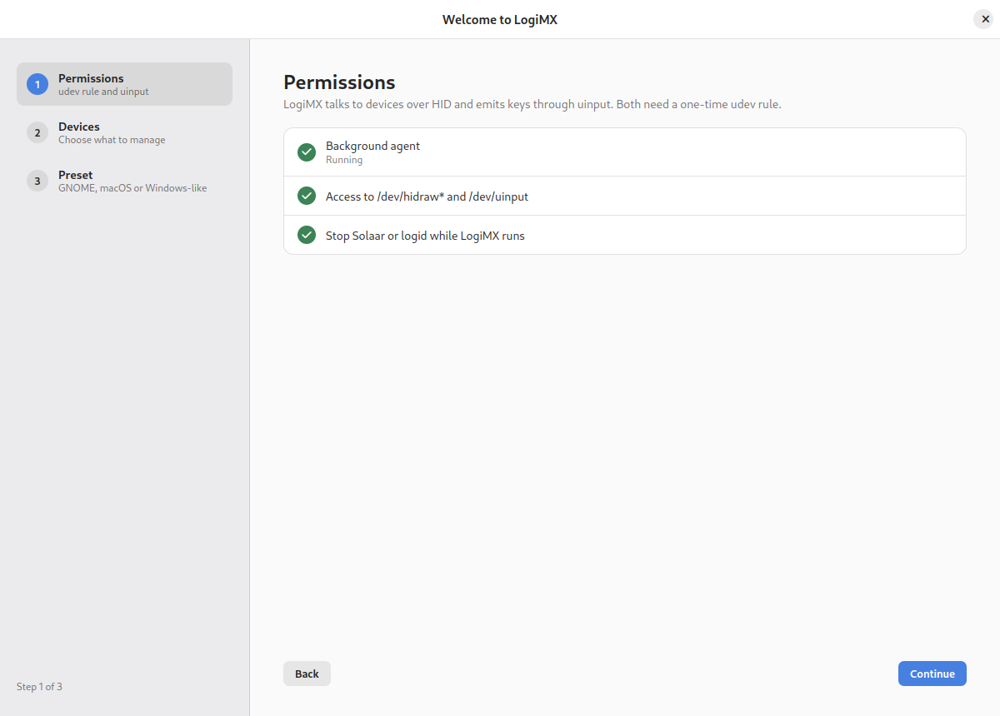

## How it works

A native agent owns the devices in the background. The desktop app talks to it over a local socket.

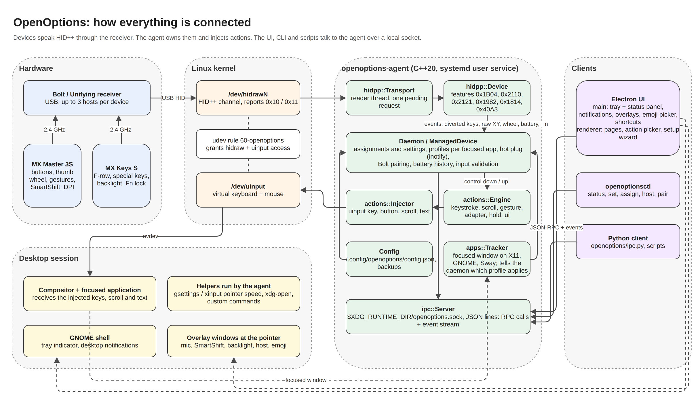

The agent talks HID++ to the receiver or to a Bluetooth device. It diverts the controls that are
customised, so the device reports them to the agent instead of sending its own key, and performs
the chosen action through a virtual input device. Because this happens below the compositor, it
works the same on X11 and Wayland.

```
agent/          C++20 agent: HID++ 1.0 and 2.0, actions, focus tracking, JSON RPC. One codebase:
                Linux uses hidraw, uinput and a UNIX socket; Windows uses hidapi, SendInput and a
                named pipe; macOS uses hidapi, Quartz events and a UNIX socket (src/platform/).
ui/             Electron app in plain HTML, CSS and JavaScript.
logimx/         Python version of the agent with the same RPC and settings format, kept as a
                reference and for scripting.
udev/           Access rule for hidraw and uinput.
systemd/        User service for the agent.
packaging/      .deb build.
```

## Requirements

On Windows and macOS: Windows 10 or 11 (x64), or macOS 11 or newer. Nothing else.

On Linux:

- The kernel's HID++ receiver drivers (included in mainstream distributions)
- Read and write access to `/dev/hidraw*` and `/dev/uinput`, given by `udev/60-logimx.rules`
  (installed by the .deb and by the first-run wizard)
- On GNOME, the tray icon needs the AppIndicator extension (`gnome-shell-extension-appindicator`),
  which Ubuntu ships enabled

Other tools that divert the same buttons, such as Solaar or logid, should not run at the same time.

## Build from source

Needs g++ 11 or newer, cmake, ninja, libx11-dev and Node.js 18 or newer.

```
./run-agent.sh -v            # terminal 1: builds the agent on first run and logs to the terminal
./run-ui.sh                  # terminal 2: the window and the tray icon (--hidden starts in the tray)
```

Install for the current user (agent in `~/.local/bin`, systemd user service):

```
./install.sh
sudo cp udev/60-logimx.rules /etc/udev/rules.d/ && sudo udevadm control --reload && sudo udevadm trigger
```

Packages: `packaging/deb/build.sh` for the .deb, `cd ui && npm run dist:appimage` for the AppImage.

Windows (from Windows, or cross-compiled from Linux with [llvm-mingw](https://github.com/mstorsjo/llvm-mingw)):

```
cmake -S agent -B agent/build -G Ninja -DCMAKE_BUILD_TYPE=Release \
      -DCMAKE_TOOLCHAIN_FILE=agent/cmake/mingw-w64-x86_64.cmake -DLLVM_MINGW=/path/to/llvm-mingw   # from Linux only
cmake --build agent/build
cd ui && npm run dist:win          # ui/dist/LogiMX-Setup-<version>.exe
```

macOS (Xcode command line tools, cmake, Node.js):

```
cmake -S agent -B agent/build -DCMAKE_BUILD_TYPE=Release -DCMAKE_OSX_ARCHITECTURES="arm64;x86_64"
cmake --build agent/build
cd ui && npm run dist:mac          # ui/dist/LogiMX-<version>-arm64.dmg and -x64.dmg
```

CI builds all three on every tag (`.github/workflows/release.yml`).

## Pairing to a Bolt receiver

Use "Pair a device" in the menu. If the device is also known to Bluetooth on the same computer, the
pairing can fail a few seconds after the passcode is typed, because BlueZ keeps trying to reach the
device on the same radio band. In that case pair with Bluetooth switched off:

```
./pair-bolt.sh
```

It turns Bluetooth off, waits for the device, shows the passcode, and turns Bluetooth back on when
it exits.

## Command line

```
logimxctl devices
logimxctl set b034 dpi 1600
logimxctl set b034 smartshift.threshold 20
logimxctl set b378 backlight.mode manual
logimxctl set b378 backlight.level 5
logimxctl assign b034 buttons 195 gesture_windows
logimxctl assign b034 thumbwheel - volume_wheel
logimxctl assign b378 keys 264 emoji_picker
logimxctl host b378 2
logimxctl presets
```

Settings are kept in `~/.config/logimx/config.json`. Devices are identified by product id (see
[Supported devices](#supported-devices)) and controls by their HID++ control id.

## Reporting a problem

Have a wish or found a problem? The home screen and the menu have **Make a wish** and **Report an
issue**. A wish opens a feature request on GitHub with only the version, the system and the device
names beside it. Wishes are granted within 24 hours.

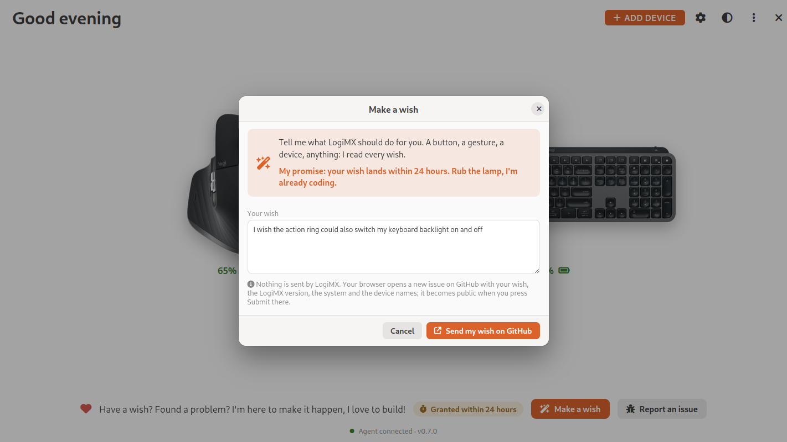

About, Report a problem collects what is needed to reproduce an issue: versions, desktop, the
devices and what they report, and the last lines of the agent's log. It opens a new GitHub issue in
the browser with that text filled in, and the whole text is shown first. Serial numbers, host names
and the user name are removed, and custom commands are reduced to their kind. LogiMX sends nothing
itself; the issue is filed from your own account.

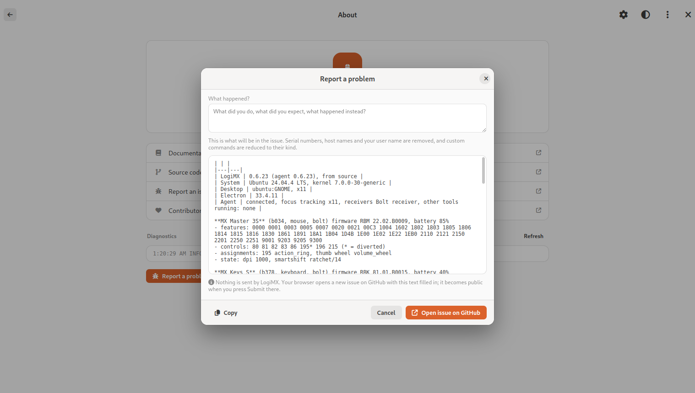

## Status

Tested on Ubuntu 24.04 with GNOME on X11, with the MX Master 3S, MX Master 4 and MX Keys S on a Bolt
receiver and the MX Keys S over Bluetooth. Users run it on Ubuntu with GNOME on Wayland, where the
focused application is tracked through the Shell when that interface is enabled.

Planned: Easy-Switch and per-application settings from the device pages, more MX devices, and focus
tracking on KDE and Sway.

## Related projects

- [Solaar](https://github.com/pwr-Solaar/Solaar): device manager for Unifying and Bolt receivers
  with broad HID++ feature coverage
- [logiops](https://github.com/PixlOne/logiops): daemon with gestures and SmartShift, configured
  through a text file
- [libratbag](https://github.com/libratbag/libratbag) and Piper: DPI and button configuration for
  gaming mice

## License

MIT
